# Procesverslag
Markdown is een simpele manier om HTML te schrijven.  
Markdown cheat cheet: [Hulp bij het schrijven van Markdown](https://github.com/adam-p/markdown-here/wiki/Markdown-Cheatsheet).

Nb. De standaardstructuur en de spartaanse opmaak van de README.md zijn helemaal prima. Het gaat om de inhoud van je procesverslag. Besteedt de tijd voor pracht en praal aan je website.

Nb. Door *open* toe te voegen aan een *details* element kun je deze standaard open zetten. Fijn om dat steeds voor de relevante stuk(ken) te doen.

## Jij

  
uitwerken voor kick-off werkgroep

  ### Auteur:
  Redouane Ibrahimi

  #### Je startniveau:
  Blauw

  #### Je focus:
  Responsive
 

## Je website

  
uitwerken voor kick-off werkgroep

  ### Je opdracht:
  https://rednyellow.github.io/fed_inh/

  #### Screenshot(s) van de eerste pagina (small screen): 
  Campina.nl - Home pagina. 
  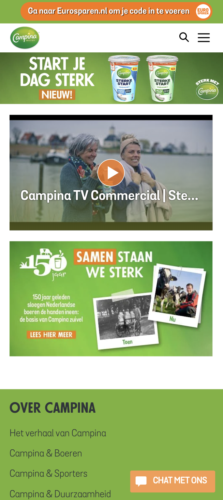

  #### Screenshot(s) van de tweede pagina (small screen):
  Campina.nl - Producten pagina. 
  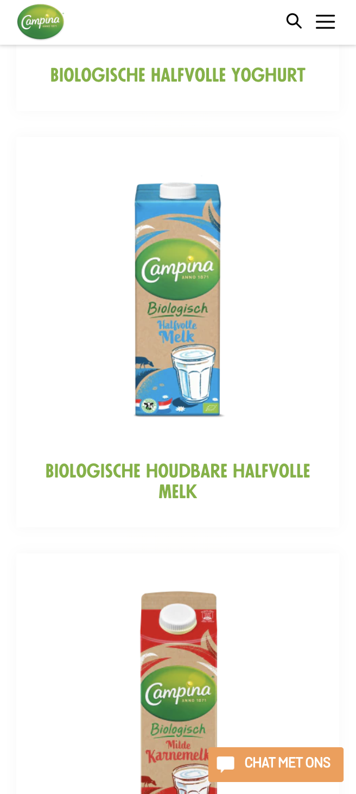
 

## Toegankelijkheidstest 1/2 (week 1)

  
uitwerken na test in 1e werkgroep

  ### Bevindingen
  Lijst met je bevindingen (Website van klasgenoot Kenneth) die in de test naar voren kwamen:

  Bevinding 1: De homepagina van de website bevat geen headings. Deze staan niet als optie in de Rotor.
  Bevinding 2: Op de homepagina zijn de linkjes vrij duidelijk. Vooral omdat (bijna) alle content hierop linkjes zijn.
  Bevinding 3: De links zijn ook de titels.

  #### Screenreader
  Door middel van de rotor kun je selecteren op welk onderdeel je wilt zoeken met de voice over (FOTO ROTOR google)

Screenreader heading:

Geeft aan of het h1,h2, h3 of h4 is

Op Campina home is de menu banner h2

H3 zijn de kopjes in de footer.

Geeft aan dat je op de laatste heading bent als je helemaal naar beneden scrollt

Screanreader links:

Veel links op de pagina van Campina. Interessante is dat die zelfs door de links in de dropdown van de menu items heengaat, deze zijn niet zichtbaar tenzij je over de menu items hoverd. Apart maar dit kan voor een blinde denk ik wel handig zijn om te zien wat er allemaal in de navigatie zit.

Geeft aan dat dat ‘first link’ in de UPS bar zit.

  #### Muis en Toetsenbord 
  Hier korte omschrijving (met indien nodig afbeeldingen)

Bediening:

Kan alleen door de site navigeren door te tabben en dit gaat alleen naar beneden. Het is dus niet mogelijk op met de pijltjes naar links en rechts te navigeren.

Door de pijltjes te gebruiken of spatie kun je scrollen op de pagina.

Volgorde:

De volgorde gaat door de lists heen. In de footer gaat dat van boven naar beneden

Op de producten pagina gaat de volgorde door de list heen wel horizontaal.

Ook ga je door deze manier van navigeren weer door alle submenu items die niet zichtbaar zijn.

State:

Active state word getoond als iets geselecteerd is dmv te tabben. Hover en focus niet.

  Hier een omschrijving van hoe het opgelost kan worden (met indien nodig afbeeldingen)

  #### Motoriek (shocks, elastiekjes)
  Hier korte omschrijving (met indien nodig afbeeldingen)

  Hier een omschrijving van hoe het opgelost kan worden (met indien nodig afbeeldingen)

  #### Visueel (brillen, contrast, kleurenblind, dark/light). 
  Hier korte omschrijving (met indien nodig afbeeldingen)

Kleuren:

De Campina branding (groene kleur) komt niet terug bij verschillende soorten van kleurenblindheid maar alle elementen zijn nog wel te zien en te begrijpen

(FOTOx2)

Dark/light-mode:

Er is geen dark-mode beschikbaar vanuit de browser en er is ook geen toggle om dark-mode aan te zetten op de website zelf.

  Hier een omschrijving van hoe het opgelost kan worden (met indien nodig afbeeldingen)

## Breakdownschets (week 1)

  
uitwerken na afloop 2e werkgroep

  ### de hele pagina: 
  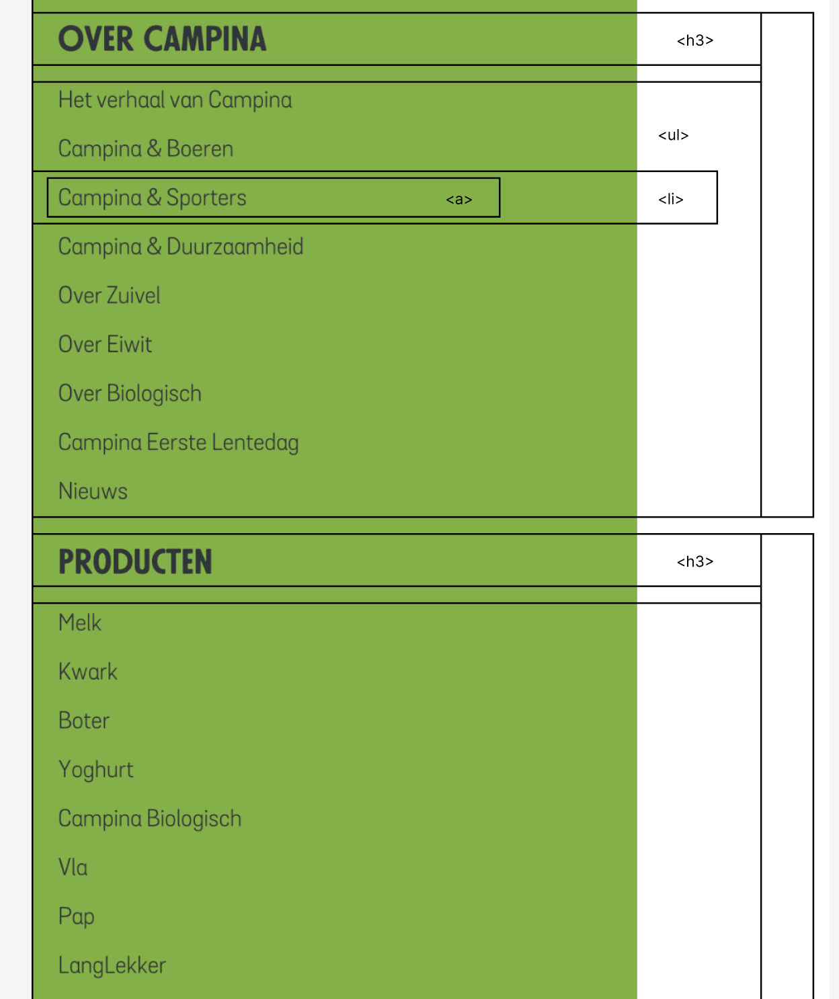

  ### dynamisch deel (bijv menu): 
  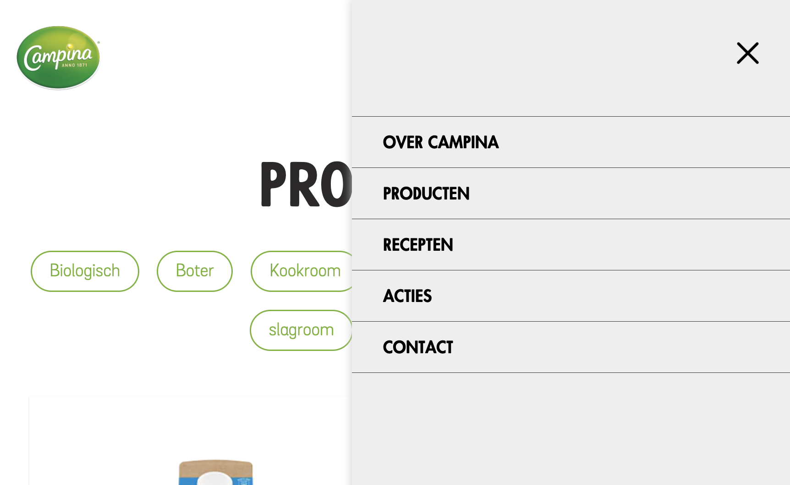

  ### wellicht nog een dynamisch deel (bijv filter): 
  

## Voortgang 1 (week 2)

  
uitwerken voor 1e voortgang

  ### Stand van zaken
  hier dit ging goed & dit was lastig (neem ook screenshots op van delen van je website en code)

  ### Agenda voor meeting
  samen met je groepje opstellen

 Clubje B1
  | Deveney      
  | Redouane         
  | Melvin
  
 Punten die we hebben besproken:
 - Vragen over het Hamburger-menu (hoe en in welke volgorde coderen...etc.)
 - 

  ### Verslag van meeting
  hier na afloop snel de uitkomsten van de meeting vastleggen

  - punt 1
  - punt 2
  - nog een punt
  - ...

## Voortgang 2 (week 3)

  
uitwerken voor 2e voortgang

  ### Stand van zaken
  Dit keer heb ik meegedaan met een andere groepje dan mijn standaard groepje. 

  ### Agenda voor meeting
  samen met je groepje opstellen

  | student 1      | student 2          | student 3    | student 4        |
  | ---            | ---                | ---          | ---              |
  | dit bespreken  | en dit             | en ik dit    | en dan ik dat    |
  | en dat ook nog | dit als er tijd is | nog een punt | dit wil ik zeker |
  | ...            | ...                | ...          | ...              |

  ### Verslag van meeting
  hier na afloop snel de uitkomsten van de meeting vastleggen

  - punt 1
  - punt 2
  - nog een punt
- ...

## Toegankelijkheidstest 2/2 (week 4)

  
uitwerken na test in 8e werkgroep

Ik heb tijdens deze les de website van Josette Derksen getest op toegankelijkheid. En zij de mijne. Dit zijn wat mij het meest opviel tijdens de test:

- Voice Over:
Wat ging goed?
-Herkent alle headings, de linkjes in de navigatie en de footer.

Wat ging minder goed?
-Bij mijn tweede pagina (producten) moet ik nog van de losse producten links maken om te weten dat het klikbaar is.

- Kleurenbindheid:

Ervoor zorgen dat elk link op mijn websites een hover state hebben + een andere kleur.

- Bij gebruik van de toegangkelijkhgeid-bril:

Het viel mij op dat als ik de wazige bril gebruik dat de cursor niet duidelijk is. Ik besefte daardoor hoe belangrijk de grootte is van de cursor is het geval dat iemand bijvoorbeeld zijn bril niet bij zich heeft.

## Voortgang 3 (week 4)

  
uitwerken voor 3e voortgang

  ### Stand van zaken
  hier dit ging goed & dit was lastig (neem ook screenshots op van delen van je website en code)

  ### Agenda voor meeting
  Samen met mijn groepje hebben wij deze vragen opgesteld voor bij de voortgang gesprek:

  | Redouane
    - Vragen over uitklapbare menu en @media
    - Vragen over toegangkelijkheid als het gaat om Campina.nl boezoekers (doelgroep)
    - Waar moet ik het meest op letten als het gaat om responsiveness.
    - Een voorbeeld geven van position dat lijkt op wat ik heb op mijn site.
  
  | Deveney
    - Hoe kun je hamburger menu positie aanpassen
    - Wanneer wel een div gebruiken voor styling?
    - Position sticky item staat boven de ander
  
  | Melvin
    - 
  

  
  | Diem
    - Hamburger menu 
    - CSS hover img groter maken 
    - CSS positioneren horizontaal list items

  ### Verslag van meeting
  hier na afloop snel de uitkomsten van de meeting vastleggen

  - Gekeken naar hoe je een onbekend vormpje maakt in css.
  - Geleerd hoe je een lijst krijg percies onder een andere list-item.
  - Het gebruiken van Grid en met animatie elementen laten verschijnen 
  - Elementen ordenen met grid...

  Met behulp van Sanne heb ik de <main> verandert, beide html( ul en li nesting i.p.v section waarin de ul > li) en css (grid i.p.v felxbox).

  Oude code:

  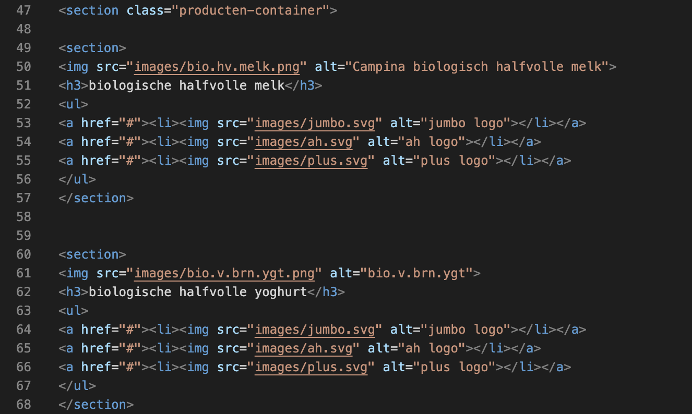

  Nieuwe code:

  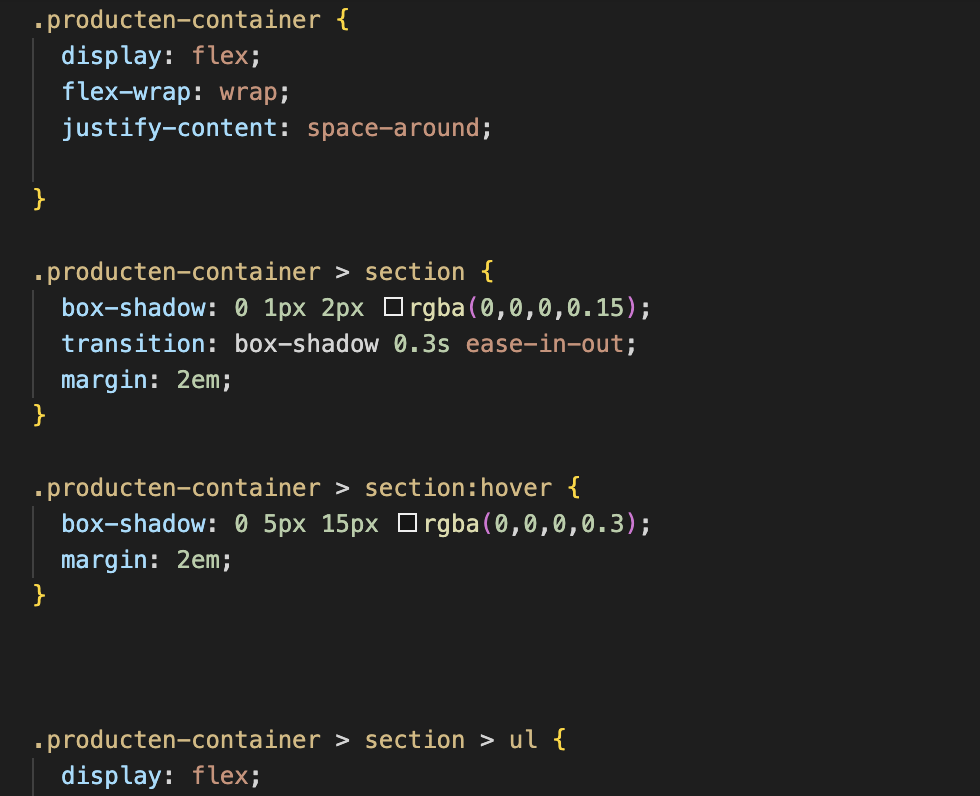

### Minder goede code:

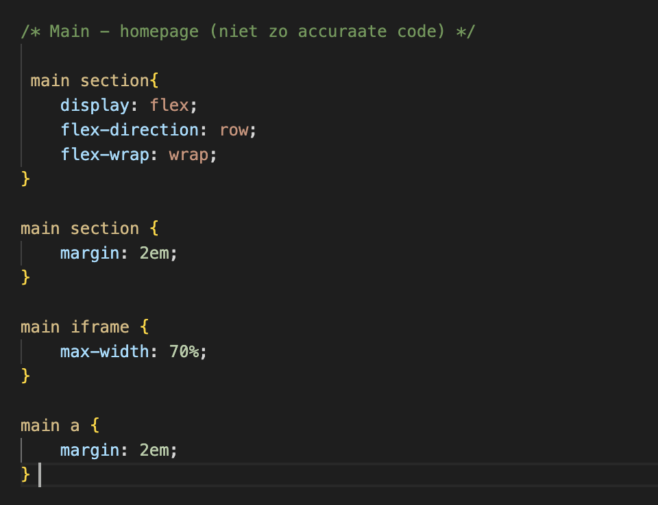

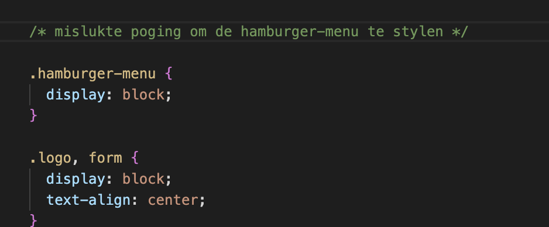

### Stukje proces:

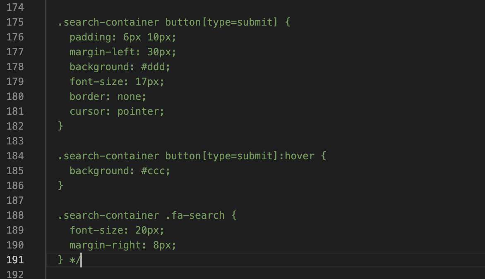

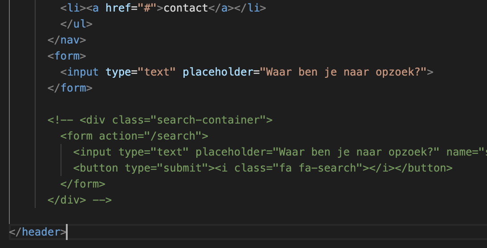

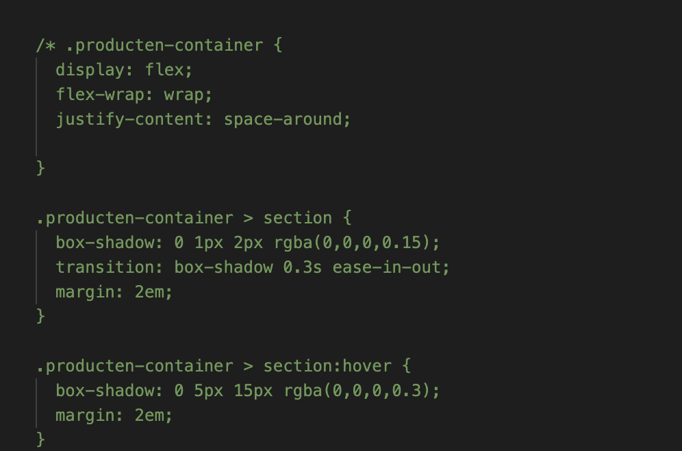

## Eindgesprek (week 5)

  
uitwerken voor eindgesprek

  ### Je uitkomst - karakteristiek screenshots:
  

  ### Dit ging goed/Heb ik geleerd: 
  Met behulp van een oefening van de JS week heb ik een opzetje kunnen hebben voor mijn uitklapbare menu met een "hamburger menu".

  Wat ik het meest heb geleerd is dat het durven te experimenteren met verschillende manieren code te schrijven en kijken naar de live veranderingen op de website. Zo leerde ik onbuwest hoe CSS en JS in elkaar zit (vooral in praktijk).

  Het stres gevoel aan het begin van dit vak wanneer het mis gaat met mijn code is ook veel minder geworden, en dat kwam zeer waarchijnlijk door veel te oefenen, door blijven proberen en de fouten(errors) te accepteren en proberen te corrigeren.

  

  ### Dit was lastig/Is niet gelukt:
  Ik vond het lastig om een uitklapbare lijst te maken dat verschijnt wanneer ik hover op de nav > ul elementen:

  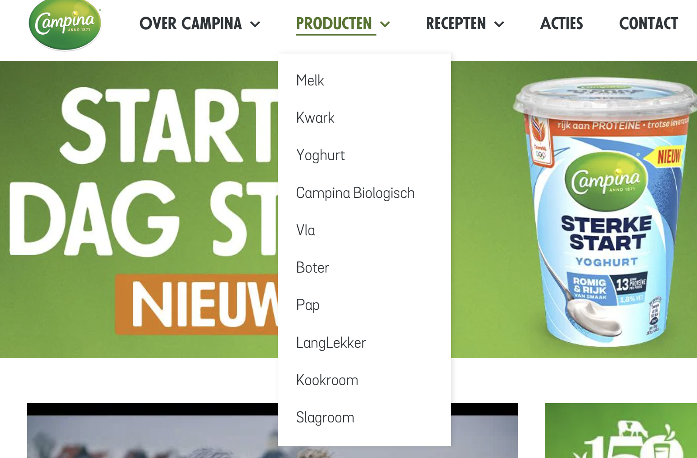

## Bronnenlijst

  
continu bijhouden terwijl je werkt

  Nb. Wees specifiek ('css-tricks' als bron is bijv. niet specifiek genoeg).

  1. https://developer.mozilla.org/en-US/docs/Web/CSS/height
  2. https://css-tricks.com/snippets/css/a-guide-to-flexbox/
  3. https://cssgridgarden.com/
  4. https://codepen.io/shooft/pen/GRGVdmw

